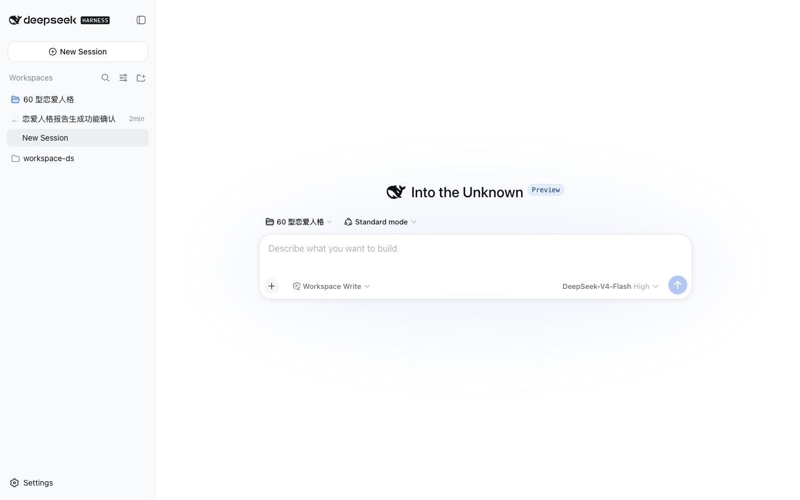
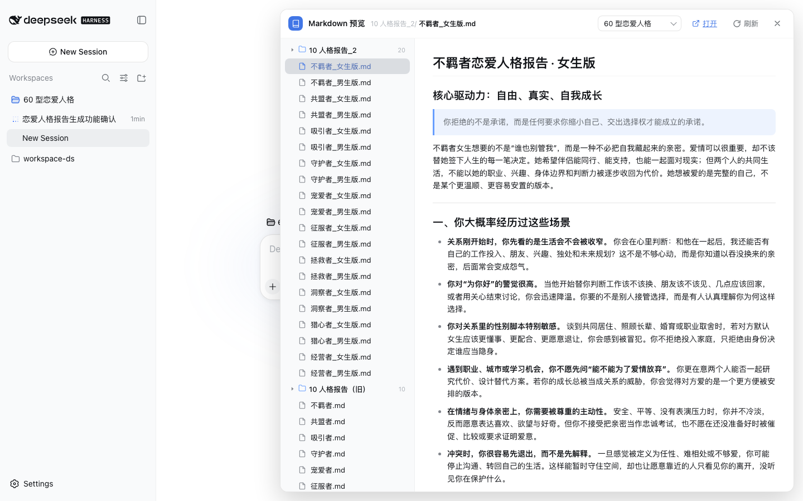

# dsh-md-preview

在 dsh Web 界面中**列出并阅读工作区（workspace 目录）里的 Markdown 文件**的插件：

- **触发入口在侧边栏 workspace 行上**：鼠标悬停任意工作区行，行尾出现 📖 按钮，点击直接打开该工作区的 Markdown 预览
- **操作集中在面板顶栏**：打开（系统默认应用）、刷新列表、关闭（Esc）
- 左侧为**嵌套目录树**：文件夹可折叠、缩进分层、目录带文件计数、悬停显示完整路径
- 右侧内联渲染 Markdown（标题、列表、表格、代码块、引用、图片、链接等）
- 样式全部使用 DSH 设计 token（`--dsw-alias-*`），自动跟随应用明暗主题

## 效果

| 侧边栏触发按钮 | 预览面板 |
|---|---|
|  |  |

## 安装

1. 将本目录安装到 web profile（本地开发）或从 GitHub 安装：

   ```bash
   cd ~/.dsh/profiles/web
   # 本地开发（推荐，改完跑 scripts/sync.sh 同步）
   pnpm add file:/Users/leeo/Documents/workspace-ds/dsh-md-preview
   # 或直接从 GitHub 安装
   pnpm add github:ywleeo/dsh-md-preview
   ```

2. 在 `~/.dsh/profiles/web/cordis.patch.yml` 追加（用户 patch 层热加载，无需重启）：

   ```yaml
   - insert:
       - id: dsh-md-preview
         name: dsh-md-preview
   ```

3. 刷新浏览器页面（http://127.0.0.1:3080），侧边栏 workspace 行悬停即出现 Markdown 按钮。

## 工作原理

- **host 半**（`index.js`）：注册同源路由 `/plugins/dsh-md-preview/{workspaces,list,read,open}`，
  用持久化随机 token 门控；token 通过 `webServer.tapIndex` 注入到 index.html 的 `<meta>` 标签。
- **client 半**（`client.js`）：普通 `<script>`（`window.__ModuleLoader__.load`），纯 DOM 实现
  侧边栏按钮注入（MutationObserver 跟随 React 重渲染）+ 面板 + 迷你 Markdown 渲染器。
- 安全边界：`/list` 与 `/read` 只接受**已注册工作区目录之下**的路径
  （`fs.contains` 校验），不越权读取工作区外文件。

## 路由

| 路由 | 说明 |
|------|------|
| `GET /plugins/dsh-md-preview/workspaces?t=<token>` | 列出已注册工作区 `[{path, title}]` |
| `GET /plugins/dsh-md-preview/list?t=<token>&p=<dir>` | 递归列出目录下 md 文件（限深 6、限 2000 个） |
| `GET /plugins/dsh-md-preview/read?t=<token>&p=<path>` | 返回 md 原文（上限 1MB） |
| `GET /plugins/dsh-md-preview/open?t=<token>&p=<path>` | 系统默认应用打开，302 到 /read |
